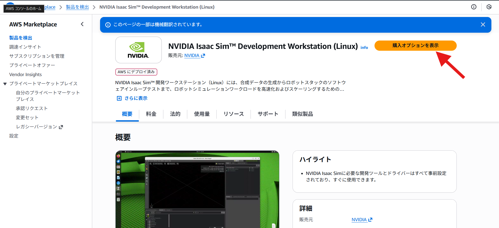
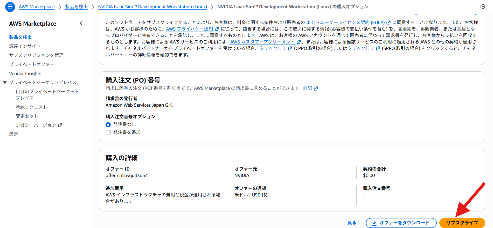
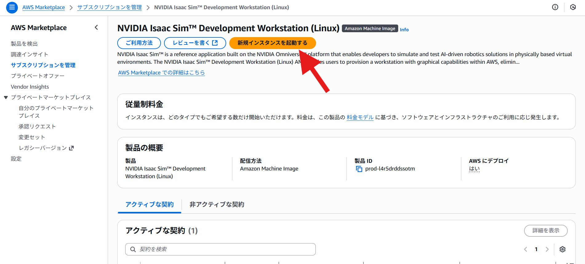
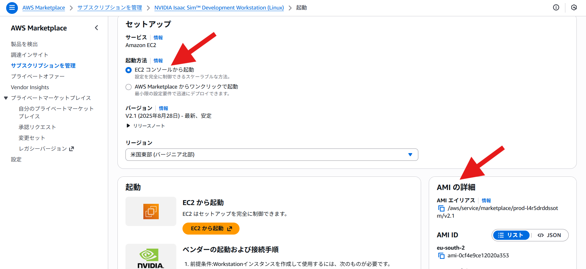

# AWS CloudFormation による環境構築ガイド

AWS CloudFormationを使用してIsaac Sim環境を構築する方法です。

**注意**: このガイドでは、東京リージョン（`ap-northeast-1`）を使用します。AWS CLIのデフォルト設定（`~/.aws/config`）でリージョンが設定されている場合は、`--region` オプションは省略可能です。他のリージョンを使用する場合は、AMI IDやリージョン指定を適宜変更してください。

## AWS CloudFormationとは

**AWS CloudFormation**は、Infrastructure as Code (IaC) のサービスで、JSONまたはYAML形式のテンプレートを使用してAWSリソースを定義・管理できます。

### メリット

- ✅ **テンプレート化**: 環境をコードとして管理
- ✅ **再現性**: 同じ環境を何度でも作成可能
- ✅ **バージョン管理**: Gitで管理できる
- ✅ **自動化**: スタックの作成・更新・削除を自動化
- ✅ **依存関係の管理**: リソース間の依存関係を自動処理
- ✅ **ロールバック**: 問題発生時に自動ロールバック

### その他のAWSサービスとの比較

| サービス | 用途 | 特徴 |
|---------|------|------|
| **CloudFormation** | インフラ全体の管理 | YAML/JSONテンプレート、AWS標準 |
| **AWS CDK** | プログラミング言語で定義 | TypeScript/Python等、より柔軟 |
| **AWS Launch Templates** | EC2起動設定のみ | シンプル、EC2専用 |
| **AWS Systems Manager** | インスタンス管理 | 既存インスタンスの管理 |

## 前提条件: AWS CLIの設定（CloudShell 前提）

このガイドでは、**AWS CloudShell をメインの実行環境** として想定し、AWS CLIを使用してCloudFormationスタックを管理します。

CloudShell では、以下があらかじめ用意されています：

- AWS CLI がインストール済み
- 一時的な認証情報（アクセスキー）が自動的に付与済み
- ログイン中のアカウント／権限で `aws` コマンドがすぐに利用可能

そのため **CloudShell を使う場合、IAMユーザーのアクセスキーIDやシークレットアクセスキーを自分で発行して `aws configure` に入力する必要はありません。**

### AWS認証情報の設定（CloudShell）

- ブラウザで AWS マネジメントコンソールにログインし、右上の「>_ CloudShell」ボタンから CloudShell を起動してください。
- CloudShell では、**認証情報（アクセスキーID／シークレットアクセスキー）は自動付与** されるため、通常は設定不要です。
- 次のコマンドで、現在の実行主体（ユーザーまたはロール）を確認できます：

```bash
aws sts get-caller-identity
```

- 別アカウント／別プロファイルで操作したいなどの特殊なケースを除き、**CloudShell では `aws configure` でアクセスキーを入力する必要はありません。**
  - CloudShell が紐づいているアカウント／ロールの権限により、CloudFormation や EC2 を操作できるかどうかが決まります。
  - 必要に応じて管理者に、CloudFormation・EC2・IAM などの権限を付与してもらってください。

## セットアップ手順

### ステップ1: 必要なリソースの準備

#### 1-1. EC2キーペアの作成（新規作成が必要な場合）

EC2インスタンスにSSH接続するために、キーペアが必要です。既存のキーペアがある場合はスキップしてください。

**方法A: AWS CLIで作成（推奨）**

```bash
# キーペア名を指定（例: isaac-sim-keypair）
KEYPAIR_NAME="isaac-sim-keypair"

# ~/.ssh ディレクトリが無い場合は作成（CloudShell初回利用時など）
mkdir -p ~/.ssh
chmod 700 ~/.ssh

# キーペアを作成
aws ec2 create-key-pair \
  --key-name $KEYPAIR_NAME \
  --query 'KeyMaterial' \
  --output text > ~/.ssh/$KEYPAIR_NAME.pem

# パーミッションを設定（重要！）
chmod 400 ~/.ssh/$KEYPAIR_NAME.pem

# 作成されたキーペアを確認
aws ec2 describe-key-pairs \
  --key-names $KEYPAIR_NAME
```

**方法B: AWSマネジメントコンソールで作成**

1. [EC2コンソール](https://ap-northeast-1.console.aws.amazon.com/ec2/)にアクセス
2. 左メニューから「キーペア」を選択
3. 「キーペアを作成」をクリック
4. キーペア名を入力（例: `isaac-sim-keypair`）
5. 「プライベートキーファイル形式」で「pem」を選択
6. 「キーペアを作成」をクリック
7. ダウンロードされた`.pem`ファイルを`~/.ssh/`に保存し、パーミッションを`400`に設定

**既存のキーペアを確認**

```bash
# 利用可能なキーペア一覧を表示
aws ec2 describe-key-pairs \
  --query 'KeyPairs[*].KeyName' \
  --output table
```

#### 1-2. Isaac Sim AMI IDの取得

Isaac Sim用のAMI IDは、リージョンごとに異なります。以下の方法で取得できます。

1. [AWS Marketplace - NVIDIA Omniverse Isaac Sim](https://aws.amazon.com/marketplace/pp/prodview-bl35herdyozhw)にアクセス
2. 画面右上または右側にある  
   - 日本語UIの場合: **「購入オプションを表示」** をクリック

1. 続いて表示される画面で  
   - 日本語UIの場合: **「サブスクライブ」** をクリック

1. 続いて表示される画面で  
   - 日本語UIの場合: **「新規インスタンスを起動する」** を選択  
   ※すぐにインスタンス起動されるワケではないです


1. 「AMI の詳細」から AMI ID を確認  
    - **起動方法**を選択し、東京リージョンのAMI IDを取得 

#### 1-3. 自分のIPアドレスの取得

セキュリティのため、SSHとVNC接続を自分のIPアドレスのみに制限することを推奨します。

```bash
# 現在のパブリックIPアドレスを取得
MY_IP=$(curl -s https://checkip.amazonaws.com)
echo "Your IP address: $MY_IP"
echo "CIDR format: $MY_IP/32"
```

**手動で確認する場合**

- [What Is My IP Address](https://www.whatismyip.com/)などのサービスで確認
- 取得したIPアドレスに`/32`を付けてCIDR形式にする（例: `203.0.113.1/32`）

**注意**: 自宅やオフィスから接続する場合、IPアドレスが変わる可能性があります。その場合は`0.0.0.0/0`（すべてのIPを許可）を使用できますが、セキュリティリスクが高くなります。

#### 1-5. Omniverse Streaming Clientの準備

Isaac Simをリモートで快適に操作するために、**Omniverse Streaming Client** の使用を推奨します。テンプレートでは以下のポートが開放されます：

- **TCP 8899**: Omniverse Kit Remote (HTTP/WebSocket)
- **TCP/UDP 49000-49100**: WebRTC Media Streaming
- **TCP 5900-5910**: VNC (予備手段として維持)

これにより、ブラウザベースのWebRTCストリーミングや、ネイティブクライアントによる低遅延な操作が可能になります。

#### 1-4. インスタンスタイプの選択

テンプレートで利用可能なインスタンスタイプ：

- `g4dn.xlarge`: コスト効率が良い、旧世代（T4 GPU）- **学習用途に推奨**
- `g4dn.2xlarge`: g4dn.xlargeの2倍の性能
- `g5.xlarge`: 新世代（A10G GPU）
- `g6e.xlarge`: 最新世代（L40S GPU、2倍の性能、高コスト）
- `g6e.2xlarge`: g6e.xlargeの2倍の性能

### ステップ2: パラメータファイルの編集

`cloudformation/parameters.json` を編集して、実際の値を設定します。

**パラメータの説明**

| パラメータ | 説明 | 取得方法 | デフォルト値 |
|-----------|------|---------|------------|
| `InstanceType` | EC2インスタンスタイプ | 上記1-4を参照 | `g4dn.xlarge` |
| `AMIId` | Isaac Sim用AMI ID | 上記1-2を参照 | `ami-XXXXX`（要変更） |
| `KeyPairName` | EC2キーペア名 | 上記1-1を参照 | 要設定 |
| `AllowedSSHCIDR` | SSH接続許可CIDR | 上記1-3を参照 | `0.0.0.0/0`（全許可） |
| `AllowedVNCCIDR` | VNC接続許可CIDR | 上記1-3を参照 | `0.0.0.0/0`（全許可） |
| `VolumeSize` | EBSボリュームサイズ（GB） | 128-1000の範囲で指定 | `150` |
| `UseSpotInstance` | スポットインスタンス使用 | `true`（コスト削減）または`false` | `false` |
| `SpotInstanceMaxPrice` | スポットインスタンス最大価格（USD/時） | 空文字列（`""`）でオンデマンド価格を自動使用 | `"0.10"` |
| `AutoShutdownEnabled` | 自動シャットダウン有効化 | `true`（推奨）または`false` | `true` |

**SpotInstanceMaxPriceの確認方法**

`SpotInstanceMaxPrice`は、スポットインスタンスの最大入札価格（USD/時）です。空文字列（`""`）にすると、オンデマンド価格が自動的に使用されます。明示的に設定したい場合は、以下の方法でオンデマンド価格を確認できます。

1. [EC2コンソール](https://ap-northeast-1.console.aws.amazon.com/ec2/)にアクセス
2. 左メニューから「スポットリクエスト」→「リクエスト」を選択
3. 「スポットインスタンスをリクエスト」をクリック
4. インスタンスタイプ（例: `g4dn.xlarge`）を選択
5. 「価格履歴」タブで現在のスポット価格を確認
6. オンデマンド価格も表示されるので、それを参考に設定

**推奨設定値**

- **確実に起動したい場合**: 空文字列（`""`）またはオンデマンド価格を設定
- **コスト削減を優先する場合**: オンデマンド価格の50-70%程度（例: `0.10` - `0.30`）
- **注意**: 価格が低すぎると、スポットインスタンスが取得できない場合があります

**編集例**

```json
[
  {
    "ParameterKey": "InstanceType",
    "ParameterValue": "g4dn.xlarge"
  },
  {
    "ParameterKey": "AMIId",
    "ParameterValue": "ami-0123456789abcdef0"
  },
  {
    "ParameterKey": "KeyPairName",
    "ParameterValue": "isaac-sim-keypair"
  },
  {
    "ParameterKey": "AllowedSSHCIDR",
    "ParameterValue": "203.0.113.1/32"
  },
  {
    "ParameterKey": "AllowedVNCCIDR",
    "ParameterValue": "203.0.113.1/32"
  },
  {
    "ParameterKey": "VolumeSize",
    "ParameterValue": "150"
  },
  {
    "ParameterKey": "UseSpotInstance",
    "ParameterValue": "false"
  },
  {
    "ParameterKey": "SpotInstanceMaxPrice",
    "ParameterValue": "0.10"
  },
  {
    "ParameterKey": "AutoShutdownEnabled",
    "ParameterValue": "true"
  }
]

```

**※注記**: `AllowedVNCCIDR` パラメータは、VNCポートだけでなく、Omniverse Streaming Client用のWebRTCポート（TCP/UDP 49000-49100, TCP 8899）の許可IP範囲としても使用されます。

### ステップ3: スタックのデプロイ

**デプロイ前のファイル構成確認**

デプロイスクリプトを実行する前に、必要なファイルが存在することを確認してください：

```bash
# プロジェクトルートディレクトリにいることを確認
# （CloudShellでリポジトリをクローンした場合）
cd physical-ai-learning

# 必要なファイルの存在確認
ls -la cloudformation/isaac-sim-stack.yaml
ls -la cloudformation/parameters.json
ls -la scripts/cloudformation_deploy.sh

# パラメータファイルの内容を確認（AMI IDとキーペア名が正しく設定されているか）
echo ""
echo "📋 パラメータファイルの内容:"
if command -v jq &> /dev/null; then
  cat cloudformation/parameters.json | jq '.'
else
  cat cloudformation/parameters.json
fi
```

**確認ポイント：**

- ✅ `cloudformation/isaac-sim-stack.yaml` が存在する
- ✅ `cloudformation/parameters.json` が存在する
- ✅ `parameters.json` の `AMIId` が実際のAMI IDに設定されている（`ami-XXXXX` ではない）
- ✅ `parameters.json` の `KeyPairName` が既存のキーペア名に設定されている

**デプロイ前のdry run検証（推奨）**

実際にリソースを作成する前に、変更内容を確認できます：

```bash
# 1. テンプレート構文の検証
echo "📋 テンプレート構文を検証中..."
aws cloudformation validate-template \
  --template-body file://cloudformation/isaac-sim-stack.yaml

# 2. 変更セットを作成して変更内容を確認（dry run）
# 注意: 変更セットは実際にリソースを作成しません
CHANGE_SET_NAME="dry-run-$(date +%s)"

echo ""
echo "🔍 変更セットを作成中（dry run）..."
aws cloudformation create-change-set \
  --stack-name isaac-sim-stack \
  --change-set-name $CHANGE_SET_NAME \
  --template-body file://cloudformation/isaac-sim-stack.yaml \
  --parameters file://cloudformation/parameters.json \
  --capabilities CAPABILITY_NAMED_IAM \
  --change-set-type CREATE

# 変更セットの状態を確認（数秒待ってから実行）
echo ""
echo "⏳ 変更セットの準備を待機中..."
sleep 5

# まずステータスを確認
echo ""
echo "📊 変更セットのステータス:"
aws cloudformation describe-change-set \
  --stack-name isaac-sim-stack \
  --change-set-name $CHANGE_SET_NAME \
  --query '[Status,StatusReason]'

# 変更内容の詳細を表示
echo ""
echo "📋 作成されるリソース一覧:"
aws cloudformation describe-change-set \
  --stack-name isaac-sim-stack \
  --change-set-name $CHANGE_SET_NAME

# 変更セットを削除（リソースは作成されない）
echo ""
echo "🗑️  変更セットを削除中..."
aws cloudformation delete-change-set \
  --stack-name isaac-sim-stack \
  --change-set-name $CHANGE_SET_NAME

echo ""
echo "✅ dry run検証が完了しました。"
echo "⚠️ 新規作成(CREATE)のdry runの場合、スタックが 'REVIEW_IN_PROGRESS' 状態で残ります。"
echo "   本番デプロイの前に必ず以下のコマンドでスタックを削除してください:"
echo "   aws cloudformation delete-stack --stack-name isaac-sim-stack"

```

**既存スタックの更新の場合：**

```bash
# 更新内容を確認
CHANGE_SET_NAME="update-dry-run-$(date +%s)"

aws cloudformation create-change-set \
  --stack-name isaac-sim-stack \
  --change-set-name $CHANGE_SET_NAME \
  --template-body file://cloudformation/isaac-sim-stack.yaml \
  --parameters file://cloudformation/parameters.json \
  --capabilities CAPABILITY_NAMED_IAM \
  --change-set-type UPDATE

aws cloudformation describe-change-set \
  --stack-name isaac-sim-stack \
  --change-set-name $CHANGE_SET_NAME

# 変更セットを削除
aws cloudformation delete-change-set \
  --stack-name isaac-sim-stack \
  --change-set-name $CHANGE_SET_NAME
```

#### デプロイの実行

**⚠️ 重要: 事前のクリーンアップ**

新規作成の dry run を行った場合や、以前のデプロイが中断した場合、スタックが `REVIEW_IN_PROGRESS` や `ROLLBACK_COMPLETE` の状態で残っていることがあります。
この状態では新規デプロイ（作成）が失敗するため、**必ずスタックを削除してから**実行してください。

```bash
# 残留しているスタックを削除
aws cloudformation delete-stack --stack-name isaac-sim-stack

# 削除完了を確認（エラーが出れば削除済み）
aws cloudformation describe-stacks --stack-name isaac-sim-stack
```

**デプロイコマンドの実行**

```bash
./scripts/cloudformation_deploy.sh
```

または、手動でデプロイ：

```bash
aws cloudformation create-stack \
  --stack-name isaac-sim-stack \
  --template-body file://cloudformation/isaac-sim-stack.yaml \
  --parameters file://cloudformation/parameters.json \
  --capabilities CAPABILITY_NAMED_IAM
```

### ステップ4: スタック情報の確認

```bash
./scripts/cloudformation_info.sh
```

または、AWS CLIで確認：

```bash
aws cloudformation describe-stacks \
  --stack-name isaac-sim-stack \
  --query 'Stacks[0].Outputs' \
  --output table
```

### ステップ5: インスタンスへの接続

スタックの出力からPublicIPを取得し、SSH接続：

```bash
# 出力からSSHコマンドを取得
aws cloudformation describe-stacks \
  --stack-name isaac-sim-stack \
  --query 'Stacks[0].Outputs[?OutputKey==`SSHCommand`].OutputValue' \
  --output text
```

### ステップ6: スタックの削除

```bash
./scripts/cloudformation_destroy.sh
```

または、手動で削除：

```bash
aws cloudformation delete-stack \
  --stack-name isaac-sim-stack
```

## CloudFormationテンプレートの構成

### リソース

- **IsaacSimSecurityGroup**: セキュリティグループ（SSH、VNCポート開放）
- **IsaacSimInstanceRole**: IAMロール（Systems Manager用）
- **IsaacSimInstanceProfile**: IAMインスタンスプロファイル
- **IsaacSimInstance**: EC2インスタンス
  - **UserData**: 起動時にNVIDIAドライバの状態確認と基本ツールのインストールを実行

### パラメータ

- `InstanceType`: インスタンスタイプ（g4dn.xlarge等）
- `AMIId`: Isaac Sim用AMI ID（リージョン固有）
- `KeyPairName`: キーペア名（既存のキーペアが必要）
- `AllowedSSHCIDR`: SSH接続許可CIDR（推奨: 自分のIP/32）
- `AllowedVNCCIDR`: リモートアクセス用CIDR。VNC(5900-5910)に加え、Omniverse Streaming(8899, 49000-49100)もこのCIDRで制御されます。
- `VolumeSize`: EBSボリュームサイズ（GB、128-1000の範囲、最小128GB必須）。**gp3** タイプを使用します。
- `UseSpotInstance`: スポットインスタンス使用（`true`/`false`）
- `SpotInstanceMaxPrice`: スポットインスタンス最大価格（USD/時）。空文字列でオンデマンド価格。正しく設定することで `SpotOptions` に反映されます。
- `AutoShutdownEnabled`: 自動シャットダウン有効化（`true`/`false`）

### 出力

- `InstanceId`: EC2インスタンスID
- `PublicIP`: パブリックIPアドレス
- `SecurityGroupId`: セキュリティグループID
- `SSHCommand`: SSH接続コマンド

## 高度な使い方

### パラメータの動的指定

```bash
aws cloudformation create-stack \
  --stack-name isaac-sim-stack \
  --template-body file://cloudformation/isaac-sim-stack.yaml \
  --parameters \
    ParameterKey=AMIId,ParameterValue=ami-0123456789abcdef0 \
    ParameterKey=KeyPairName,ParameterValue=my-keypair \
  --capabilities CAPABILITY_NAMED_IAM
```

### 既存VPCの使用

テンプレートを編集して、VPC IDパラメータを追加：

```yaml
Parameters:
  VPCId:
    Type: AWS::EC2::VPC::Id
    Description: VPC ID to use
```

### スタックの更新

```bash
aws cloudformation update-stack \
  --stack-name isaac-sim-stack \
  --template-body file://cloudformation/isaac-sim-stack.yaml \
  --parameters file://cloudformation/parameters.json \
  --capabilities CAPABILITY_NAMED_IAM
```

## トラブルシューティング

### エラー: スタックが作成できない

**原因1: IAM権限不足**

- CloudFormation、EC2、IAMの権限が必要
- `CAPABILITY_NAMED_IAM` を指定

**原因2: リソース制限**

- インスタンスタイプのクォータ制限
- セキュリティグループ数の制限

**原因3: AMI IDが無効**

- リージョンとAMI IDが一致しているか確認

### エラー: スタックがロールバックする

```bash
# イベントを確認
aws cloudformation describe-stack-events \
  --stack-name isaac-sim-stack \
  --max-items 10 \
  --query 'StackEvents[*].[Timestamp,ResourceStatus,ResourceStatusReason]' \
  --output table
```

### スタックの状態確認

```bash
aws cloudformation describe-stacks \
  --stack-name isaac-sim-stack \
  --query 'Stacks[0].StackStatus' \
  --output text
```

## その他のAWSサービス

### AWS Launch Templates

EC2起動設定のみをテンプレート化する場合：

```bash
aws ec2 create-launch-template \
  --launch-template-name isaac-sim-template \
  --launch-template-data file://launch-template-data.json
```

### AWS Systems Manager

既存インスタンスの管理：

```bash
# インスタンスにSSM Agentがインストールされている場合
aws ssm start-session --target i-0123456789abcdef0
```

## 参考リンク

- [AWS CloudFormation Documentation](https://docs.aws.amazon.com/cloudformation/)
- [CloudFormation Template Reference](https://docs.aws.amazon.com/AWSCloudFormation/latest/UserGuide/template-reference.html)
- [AWS CDK Documentation](https://docs.aws.amazon.com/cdk/)
